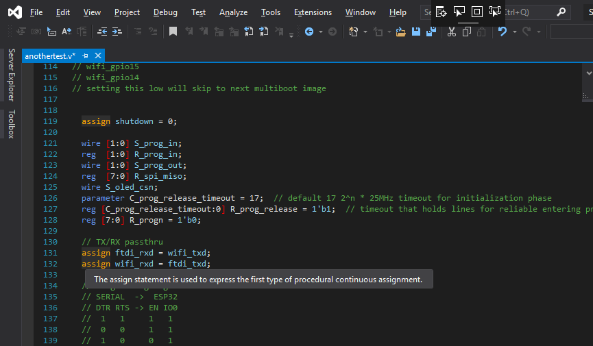
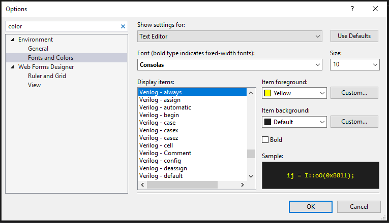
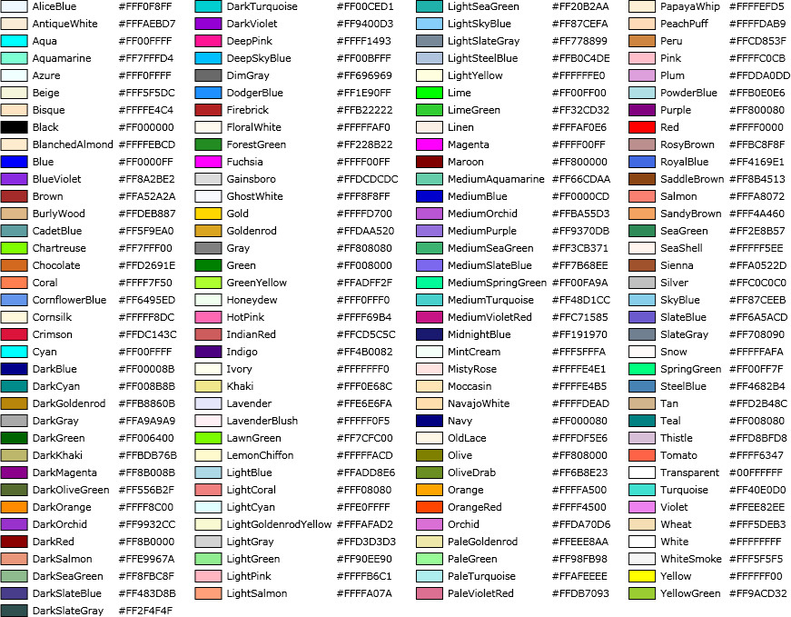
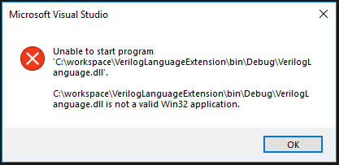
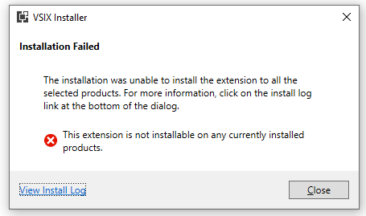
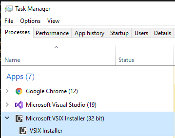
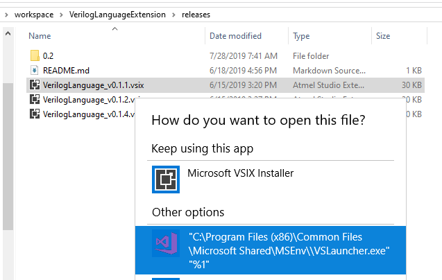

# Verilog Language Extension

This Visual Studio Extension adds syntax & keyword higlighting to Visual Studio versions 2015, 2017, and 2019. There is no notion of a "Verilog Project" or any other capabilities such as compiling or uploading to a device at this time.



On a Windows 10 machine to create FPGA binaries, consider using the [yoysys](https://github.com/YosysHQ/yosys)/[nextpnr](https://github.com/YosysHQ/nextpnr) toolchain. I have a [gist for the ULX3S](https://gist.github.com/gojimmypi/f96cd86b2b8595b4cf3be4baf493c5a7) as well as [one for the TinyFPGA](https://gist.github.com/gojimmypi/243fc3a6eead72ae3db8fd32f2567c96) in [WSL](https://gojimmypi.blogspot.com/2019/02/ulx3s-ujprog-on-windows-wsl-or-minggw.html) that may be useful in installing these along with all the respective dependencies.


## Features

* Each keyword can be individually colorized. See `File - Options - Environment - Fonts and Colors`

* Line and block comments are colorization.

* Verilog keywords have hover text documentation.

* Variables have hover text to indicate declaration, or lack thereof. Module declaration is also noted as appropriate.

* As of version 0.2x there are different default colors depending on dark or light theme. See `bool IsDarkTheme()` in `ClassificationFormat.cs`

* Multi-colored brackets, depending on nested depth. See Fonts and Colors - Display Items `Verilog - Bracket Depth [n]`


## File Extensions Supported:

These file extensions should activate this extension:

* `.v`
* `.verilog`
* `.vh`

See the line in the [VerilogClassifer](./Classification/VerilogClassifier.cs) to add more file types:

`[FileExtension(".v;.verilog;.vh")] // semi-colon delimited file extensions`


## Installation 

The easiest way to install the release version is to use the Visual Studio `Extensions - Manages Extensions`. 
Type the search word `FPGA` or `VerilogLanguage` to find the extension in the Online downloads.

Alternatively:

### Installation - Visual Studio Market Place

The VSIX file can also be downloaded manually from the Visual Studio Marketplace web site:

https://marketplace.visualstudio.com/items?itemName=gojimmypi.gojimmypi-verilog-language-extension


### Installation - Manual install with source code 

Find the location of your `VSIXInstaller.exe`, typpically in `.\Common7\IDE\` of Developer Command Prompt. Shown is an example of VS2017 Enterprise:

```
c:
cd \workspace
git clone https://github.com/gojimmypi/VerilogLanguageExtension.git
cd VerilogLanguageExtension
msbuild VerilogLanguage.csproj
"C:\Program Files (x86)\Microsoft Visual Studio\2017\Enterprise\Common7\IDE\VSIXInstaller.exe"  C:\workspace\VerilogLanguageExtension\bin\Release\VerilogLanguage.vsix
```


### Installation - Prior Releases

See [releases](./releases/README.md) directory for prior versions.


## Removal

Use either Extensions - Manage Extensions, or this command-line:

```
"C:\Program Files (x86)\Microsoft Visual Studio\2017\Enterprise\Common7\IDE\VSIXInstaller.exe" /uninstall:CF0DCF14-5B8F-4B42-8386-9D37BB99F98E
```


## Testing

Open the project and press `F5` to launch an experimental version of Visual Studio.


## Customization

Set your own preferred colors in Tools - Options - Fonts and Colors:



## Modifications

To make modifications, the [Visual Studio Extension Development Workload Toolset](https://visualstudio.microsoft.com/vs/support/selecting-workloads-visual-studio-2017/) needs to be installed.


### Version Change

Edit the version in two places: [source.extension.vsixmanifest](./source.extension.vsixmanifest) and [Properties - AssemblyInfo.cs](./Properties/AssemblyInfo.cs).


### Single word highlight

When clicking on a single word, Visual Studio highlights all the matching words. This higlight happens in [HighlightWordFormatDefinition](./Highlighting/HighlightWordFormatDefinition.cs).

See also the [EditorFormatDefinition Class](https://docs.microsoft.com/en-us/dotnet/api/microsoft.visualstudio.text.classification.editorformatdefinition?view=visualstudiosdk-2019)


### Verilog Token Types

Add a `public enum VerilogTokenTypes` value (there can be more items listed here than actually implemented) in [VerilogTokenTypes.cs](VerilogTokenTypes.cs#L19): 
```
        Verilog_begin,
```

Add a declaration in `ClassificationType.cs`
```
        /// <summary>
        /// Defines the "Verilog_begin" classification type.
        /// </summary>
        [Export(typeof(ClassificationTypeDefinition))]
        [Name("begin")]
        internal static ClassificationTypeDefinition Verilog_begin = null;
```

Add a ClassificationFormat.cs

```
    [Export(typeof(EditorFormatDefinition))]
    [ClassificationType(ClassificationTypeNames = "begin")]
    [Name("begin")]
    //this should be visible to the end user
    [UserVisible(true)] // sets this editor format definition visible for the user (in Tools>Options>Environment>Fonts and Colors>Text Editor
    //set the priority to be after the default classifiers
    [Order(Before = Priority.Default)]
    internal sealed class Verilog_begin : ClassificationFormatDefinition
    {
        /// <summary>
        /// Defines the visual format for the "begin" classification type
        /// </summary>
        public Verilog_begin()
        {
            DisplayName = "begin"; //human readable version of the name
            ForegroundColor = Colors.BlueViolet;
        }
    }
```

add a VerilogTokenTagger in `VerilogTokenTag.cs`

```
            _VerilogTypes["begin"] = VerilogTokenTypes.Verilog_begin;
```

Add `internal VerilogClassifier` entry in `VerilogClassifier.cs`
```
            _VerilogTypes[VerilogTokenTypes.Verilog_begin] = typeService.GetClassificationType("begin");
```

Optional: add `List<Completion> completions = new List<Completion>()` item for `AugmentCompletionSession` in `CompletionSource.cs`:
```
new Completion("begin"),

```

Optional: add `AugmentQuickInfoSession` section in `VerilogQuickInfoSource.cs`:
```
                else if (curTag.Tag.type == VerilogTokenTypes.Verilog_begin)
                {
                    var tagSpan = curTag.Span.GetSpans(_buffer).First();
                    applicableToSpan = _buffer.CurrentSnapshot.CreateTrackingSpan(tagSpan, SpanTrackingMode.EdgeExclusive);
                    quickInfoContent.Add("Question Begin?");
                }
```


### Verilog Variables

Similar to keywords, declared variables of type `input`, `output`, `inout`, `wire`, `reg`, and `parameter` are colorized when the definitions are found.
Otherwise they will appear in plain text white. See `BuildHoverItems(string s)` for the state machine logic that parses the data looking
for variables. Note that the text sent is assumed to be already split and de-commented.  See `LineParse(string theLine, int theLineNumber)`.


## Color Reference

From [Microsoft System.Windows.Media.Colors Class](https://docs.microsoft.com/en-us/dotnet/api/system.windows.media.colors?view=netframework-4.8)




## Troubleshooting

Although the executable extension should work for version of Visual Studio as far back as 2015, 
this solution was developed in Visual Studio 2019. Some features may be missing in prior versions, 
so it is recommended that any code changes be made in Visual Studio 2019.

### Unable to start program

If this error is encountered in Visual Studio 2019 when attempting to F5/Debug:



Try opening the [project file](VerilogLanguage.csproj) rather than the [solution](./VerilogLanguageExtension.sln).

### No visible syntax highlighting

If the extension is installed, but syntax is not highlighted, ensure the file ends with ".v" and that the extension is _enabled_:


### Unable to install downloaded VSIX file

If you see an error regarding "This extension is not installable on any currently installed products" like this:



And the install log looks like this:

```
7/28/2019 8:52:20 AM - Microsoft VSIX Installer
7/28/2019 8:52:20 AM - -------------------------------------------
7/28/2019 8:52:20 AM - Initializing Install...
7/28/2019 8:52:20 AM - Extension Details...
7/28/2019 8:52:20 AM - 	Identifier      : CF0DCF14-5B8F-4B42-8386-9D37BB99F98E
7/28/2019 8:52:20 AM - 	Name            : VerilogLanguage
7/28/2019 8:52:20 AM - 	Author          : gojimmypi
7/28/2019 8:52:20 AM - 	Version         : 0.1.4
7/28/2019 8:52:20 AM - 	Description     : Verilog Keyword highlighting for Visual Studio. Sample classifier extension to the Visual Studio Editor. Implements the Verilog Language Extension.
7/28/2019 8:52:20 AM - 	Locale          : en-US
7/28/2019 8:52:20 AM - 	MoreInfoURL     : https://github.com/gojimmypi/VerilogLanguageExtension
7/28/2019 8:52:20 AM - 	InstalledByMSI  : False
7/28/2019 8:52:20 AM - 	SupportedFrameworkVersionRange : [4.5]
7/28/2019 8:52:20 AM - 
7/28/2019 8:52:20 AM - 	Supported Products : 
7/28/2019 8:52:20 AM - 		Microsoft.VisualStudio.Community
7/28/2019 8:52:20 AM - 			Version : [14.0,17.0)
7/28/2019 8:52:20 AM - 
7/28/2019 8:52:20 AM - 	References      : 
7/28/2019 8:52:20 AM - 
7/28/2019 8:52:20 AM - Searching for applicable products...
7/28/2019 8:52:20 AM - Found installed product - Global Location
7/28/2019 8:52:20 AM - Found installed product - AtmelStudio
7/28/2019 8:52:20 AM - Found installed product - ssms
7/28/2019 8:52:20 AM - VSIXInstaller.NoApplicableSKUsException: This extension is not installable on any currently installed products.
   at VSIXInstaller.App.InitializeInstall(Boolean isRepairSupported)
   at VSIXInstaller.App.InitializeInstall()
   at System.Threading.Tasks.Task.InnerInvoke()
   at System.Threading.Tasks.Task.Execute()

```

Notice how it appears *no* versions of Visual Studio are installed. Check the process that is running:



Right click and select `Properties` or `Open File Location`. If it openes to something _older_ than
`Microsoft Visual Studio 15.0` (VS 2017) or `Microsoft Visual Studio 16.0` (VS 2019). This VSIX extension
must be opened with the Visual Studio 2017 or 2019 installer.

This behaviour was observed after a Windows update, where Windows chose to open VSIX files with the installer in:

`C:\Program Files (x86)\Microsoft Visual Studio 14.0\Common7\IDE`

As shown here:


If this is the case, try right-clicking on the VSIX installer file and select `Open With...` and then `Choose another app`.
Find the specfic installer directory desired, or this `VSLauncher.exe` default also seems to work:




## Notes

From [VSIX Manifest Designer](https://docs.microsoft.com/en-us/visualstudio/extensibility/vsix-manifest-designer?view=vs-2019):

| Visual Studio Product | Version |
| --- | --- |
| Visual Studio 2019 | 16.0 |
| Visual Studio 2017 | 15.0 |
| Visual Studio 2015 | 14.0 |
| Visual Studio 2013 | 12.0 |

* [ – minimum version inclusive.

* ] – maximum version inclusive. 

* ( – minimum version exclusive. 

* ) – maximum version exclusive.

## Limitations / TODO

* Include files are not searched

* No ability to program devices

* No linting / syntax validation

* No ability to import / export color settings

## Other Verilog Syntax Highlighters

* [V3S](https://marketplace.visualstudio.com/items?itemName=fmax.V3S-VHDLandVerilogforVisualStudio2015)  V3S - VHDL, Verilog, SystemVerilog for VS2015; Free time-limited trial, $40 and up to purchase.

* [SystemVerilog - Language Support](https://marketplace.visualstudio.com/items?itemName=eirikpre.systemverilog) VS Code Language support for Verilog / SystemVerilog (not Visual Studio)

* [Verilog HDL/SystemVerilog](https://marketplace.visualstudio.com/items?itemName=mshr-h.VerilogHDL) Verilog HDL support for VS Code (not Visual Studio)
 
## Microsoft Resources

* [Inside the editor](https://docs.microsoft.com/en-us/visualstudio/extensibility/inside-the-editor?view=vs-2019#tags-and-classifiers)

* [System.Windows.Media.Colors Class](https://docs.microsoft.com/en-us/dotnet/api/system.windows.media.colors?view=netframework-4.8)

* [Visual Studio SDK](https://docs.microsoft.com/en-us/visualstudio/extensibility/visual-studio-sdk?view=vs-2019)

* [Visual Studio Extensibility (VSX)](http://www.visualstudioextensibility.com/samples/packages/) 

* [Visual Studio Extensibility: Creating Visual Studio VSIX package extension](https://social.technet.microsoft.com/wiki/contents/articles/37071.visual-studio-extensibility-creating-visual-studio-vsix-package-extension.aspx)

* [Implementing Syntax Coloring](https://docs.microsoft.com/en-us/visualstudio/extensibility/internals/implementing-syntax-coloring?view=vs-2019)

* [Walkthrough: Display matching braces](https://docs.microsoft.com/en-us/visualstudio/extensibility/walkthrough-displaying-matching-braces?view=vs-2019)

* [Colors and Styling for Visual Studio](https://docs.microsoft.com/en-us/visualstudio/extensibility/ux-guidelines/colors-and-styling-for-visual-studio?view=vs-2019)

* [EnvironmentColors Class](https://docs.microsoft.com/en-us/dotnet/api/microsoft.visualstudio.platformui.environmentcolors?view=visualstudiosdk-2017)

* [Walkthrough: Display matching braces](https://docs.microsoft.com/en-us/visualstudio/extensibility/walkthrough-displaying-matching-braces?view=vs-2019)

* [SnapshotSpan Structure](https://docs.microsoft.com/en-us/dotnet/api/microsoft.visualstudio.text.snapshotspan)

* [SnapshotPoint Structure](https://docs.microsoft.com/en-us/dotnet/api/microsoft.visualstudio.text.snapshotpoint)

* [Walkthrough: Publish a Visual Studio extension](https://docs.microsoft.com/en-us/visualstudio/extensibility/walkthrough-publishing-a-visual-studio-extension?view=vs-2019)

* [GitHub Microsoft/VSSDK-Extensibility-Samples](https://github.com/Microsoft/VSSDK-Extensibility-Samples) [ook!](https://github.com/Microsoft/VSSDK-Extensibility-Samples/tree/master/Ook_Language_Integration)

* [ITagger<T> Interface](https://docs.microsoft.com/en-us/dotnet/api/microsoft.visualstudio.text.tagging.itagger-1?view=visualstudiosdk-2017)

* [ITextViewLine Interface](https://docs.microsoft.com/en-us/dotnet/api/microsoft.visualstudio.text.formatting.itextviewline?view=visualstudiosdk-2017) - important for positioning

## Other Resources

* [CodeProject - Extending Visual Studio to Provide a Colorful Language Editor](https://www.codeproject.com/Articles/1245021/Extending-Visual-Studio-to-Provide-a-Colorful-Lang)

* [Michael's Coding Spot - Visual Studio 2017 Extension development tutorial](https://michaelscodingspot.com/visual-studio-2017-extension-development-tutorial-part-1/)

* [Xilinx - Verilog Reserved Words](https://www.xilinx.com/support/documentation/sw_manuals/xilinx11/ite_r_verilog_reserved_words.htm)

* [Xilinx - Verilog Compiler Directives](https://www.xilinx.com/support/documentation/sw_manuals/xilinx10/isehelp/ism_r_verlang_compiler_directives.htm)

* [madskristensen - Extensibility Tools for Visual Studio](https://github.com/madskristensen/ExtensibilityTools)

* [What is the yield keyword used for in C#?](https://stackoverflow.com/questions/39476/what-is-the-yield-keyword-used-for-in-c)


## FPGA Resources

* [asic-world](http://www.asic-world.com/verilog/) - Verilog

* [asic-world](http://www.asic-world.com/vhdl/index.html) - VHDL


## Interesting Examples

* [CodyDocs](https://github.com/michaelscodingspot/CodyDocs/blob/master/CodyDocs/Events/EventAggregator.cs) (see also Michael's Coding Spot, above)

* [Asm-Dude](https://github.com/HJLebbink/asm-dude)

## See also

* https://michaelscodingspot.com/vsix-identify-mouse-hover-location-in-the-editor/

* http://linq101.nilzorblog.com/linq101-lambda.php

* https://github.com/microsoft/vs-editor-api

* [Task Parallel Library (TPL)](https://docs.microsoft.com/en-us/dotnet/standard/parallel-programming/task-parallel-library-tpl)

* [ public static SnapshotPoint? GetCaretPoint]( https://github.com/dotnet/roslyn/blob/3aae0158101ba007b856f2f5b3cf1110d2e52319/src/EditorFeatures/Core/Shared/Extensions/ITextViewExtensions.cs#L31)

* [ITextViewLine Interface](https://docs.microsoft.com/en-us/dotnet/api/microsoft.visualstudio.text.formatting.itextviewline?view=visualstudiosdk-2019)

* [ITextView.DisplayTextLineContainingBufferPosition Method](https://docs.microsoft.com/en-us/dotnet/api/microsoft.visualstudio.text.editor.itextview.displaytextlinecontainingbufferposition?f1url=https%3A%2F%2Fmsdn.microsoft.com%2Fquery%2Fdev15.query%3FappId%3DDev15IDEF1%26l%3DEN-US%26k%3Dk(Microsoft.VisualStudio.Text.Editor.ITextView.DisplayTextLineContainingBufferPosition);k(TargetFrameworkMoniker-.NETFramework,Version%3Dv4.5);k(DevLang-csharp)%26rd%3Dtrue&view=visualstudiosdk-2019)

* [yield (C# Reference](https://docs.microsoft.com/en-us/dotnet/csharp/language-reference/keywords/yield?f1url=https%3A%2F%2Fmsdn.microsoft.com%2Fquery%2Fdev15.query%3FappId%3DDev15IDEF1%26l%3DEN-US%26k%3Dk(yield_CSharpKeyword)%3Bk(TargetFrameworkMoniker-.NETFramework%2CVersion%3Dv4.5)%3Bk(DevLang-csharp)%26rd%3Dtrue)

* [TextContentChangedEventArgs Class](https://docs.microsoft.com/en-us/dotnet/api/microsoft.visualstudio.text.textcontentchangedeventargs?f1url=https%3A%2F%2Fmsdn.microsoft.com%2Fquery%2Fdev15.query%3FappId%3DDev15IDEF1%26l%3DEN-US%26k%3Dk(Microsoft.VisualStudio.Text.TextContentChangedEventArgs)%3Bk(TargetFrameworkMoniker-.NETFramework%2CVersion%3Dv4.5)%3Bk(DevLang-csharp)%26rd%3Dtrue&view=visualstudiosdk-2019#properties)

* [ITextBuffer Interface](https://docs.microsoft.com/en-us/dotnet/api/microsoft.visualstudio.text.itextbuffer?f1url=https%3A%2F%2Fmsdn.microsoft.com%2Fquery%2Fdev15.query%3FappId%3DDev15IDEF1%26l%3DEN-US%26k%3Dk(Microsoft.VisualStudio.Text.ITextBuffer)%3Bk(TargetFrameworkMoniker-.NETFramework%2CVersion%3Dv4.5)%3Bk(DevLang-csharp)%26rd%3Dtrue&view=visualstudiosdk-2019#methods)

* [ViewRelativePosition Enum](https://docs.microsoft.com/en-us/dotnet/api/microsoft.visualstudio.text.editor.viewrelativeposition?view=visualstudiosdk-2019)

* [ITextCaret.Position Property](https://docs.microsoft.com/en-us/dotnet/api/microsoft.visualstudio.text.editor.itextcaret.position?f1url=https%3A%2F%2Fmsdn.microsoft.com%2Fquery%2Fdev15.query%3FappId%3DDev15IDEF1%26l%3DEN-US%26k%3Dk(Microsoft.VisualStudio.Text.Editor.ITextCaret.Position);k(TargetFrameworkMoniker-.NETFramework,Version%3Dv4.5);k(DevLang-csharp)%26rd%3Dtrue&view=visualstudiosdk-2019)

* [Inside the editor](https://docs.microsoft.com/en-us/visualstudio/extensibility/inside-the-editor?view=vs-2019#the-text-view)

* [How to: Distribute code snippets](https://docs.microsoft.com/en-us/visualstudio/ide/how-to-distribute-code-snippets?view=vs-2019)

## Change History:

* 2019-06-22  [v0.1.5]() square bracket and content colorization; detect light/dark theme; colorize non-synthesizable keywords; hover text; new extensions `.vh` and `.verilog`
* 2019-06-17  [v0.1.4](./releases/VerilogLanguage_v0.1.4.vsix) compiled in Visual Studio 2019 instead of 2017, needed to bump version as "updates" didn't seem to see the 4th segment version change
* 2019-06-16  v0.1.3 disable code in HighlightWordFormatDefinition to use Visual Studio default selected word higlighting.
* 2019-06-16  [v0.1.2](./releases/VerilogLanguage_v0.1.2.vsix) fixes some syntax delimiter highlighting issues in comments.
* 2019-04-23  [v0.1.1](./releases/VerilogLanguage_v0.1.1.vsix) support for VS2019, remove extraneous autocomplete
* 2019-04-21  v0.1   initial code release
